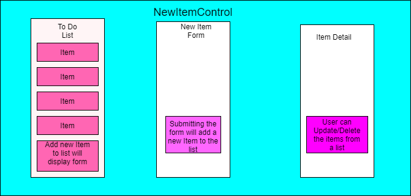
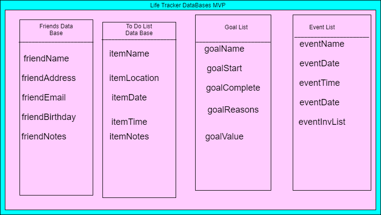
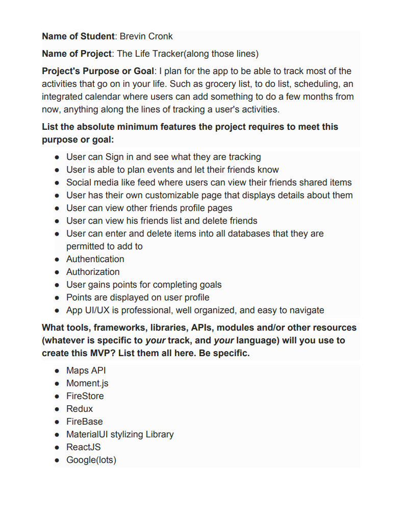
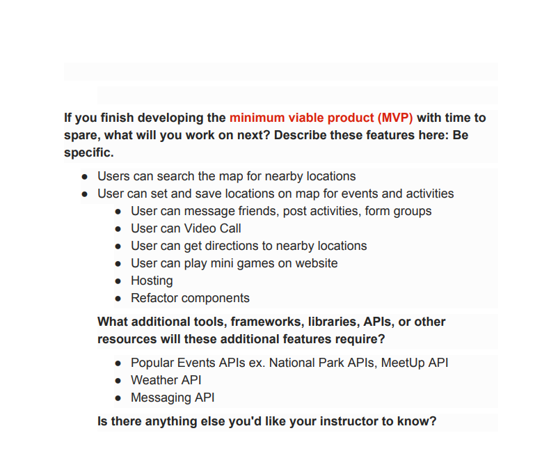

# The Life Tracker 
### By Brevin Cronk

# Overview
## The Life Tracker is my Captstone project for Epicodus. In The Life Tracker, uses will be able to add and delete to multiple different types of lists to help manage the users life. Stretch goals for this project consist of allowing the user to use a MapAPI to find local businesses and restuarants nearby, as well as other user events if they are friends with that specific user. In the end, I want this app to be able to manage nearly all aspects of the users life.

# Set Up
### To Get this program up and runing, clone the repository at https://github.com/BrevinCronk98/The-Life-Tracker. Open up  your terminal and change directories into 'the-lifetracker'. Once there, run 'npm install' in the terminal to install all of the necassary dependencies. More NPM scripts are located further down in the README in 'Available Scripts'

# Description
## The Life Tracker will track and help manage your life and daily activites. You will be able to create grocery lists, to do lists, a goal checklists and more. I plan on implementing maps for the user to use, being able to locate events, resturaunts and businesses user the maps. I want to add someform of a friend data base where a user can add friens, and will then be able to message them, add them to events, and see what they share on their feed.

 Click to See Specifications

## Specifications

| Spec | Input | Output |
| :------------- | :------------- | :------------- |
| **User Can Create an Account on App** | User Input:'Click Here To Create an Account' | Output: 'Form for account Creation will appear' |
| **User can sign in on app** | User Input:'Click herer to Sign in!' | Output: 'Signed in Successfully!!' |
| **User can Add to Their Different Types of Lists** | User Input:'Click here to add an Item to your To Do List | Output: 'Form for item creation will appear'|
| **User can Look at and Interact with MapAPI** | User Input: 'Click here to take a look at the map! | Output: 'Maps page will load, user can look around the map' |
| **App Has a HomeScreen** | User Input: 'On startup' | Output: “Title screen” |
| **User will get points for completing goals, points will be displayed on profile** | User Input:'Congrats! you completed your 5k jog!' | Output: 'User is rewarded with points' |
| **User can have their own personal page on the app to display their profile information** | User Input:'Click to View Profile' | Output:'Brevin Cronk, 21 years old, 51 goal points, Gig Harbor' |

### User can have their personal page to display their information and their lists.
* Input: 'Click to view your profile'
* Output: 'Brevin Cronk, 21 years old, 51 goal points, Gig Harbor'

### User can have their friends own personal page to display their information and their lists.
* Input: 'Click to view Bobs  profile'
* Output: 'Bob Rob, 42 years old, 56 goal points, Gig Harbor'

### User can Invite friends to events.
* Input: 'Invite Bob'
* Output: 'Bob will be recieving your invitation and we will let you know if he accepts them'

# Component Flow Chart

# Database Chart

 Click to See Capstone Proposal

 Available Scripts

This project was bootstrapped with [Create React App](https://github.com/facebook/create-react-app).

In the project directory, you can run:

### `npm start`

Runs the app in the development mode. 
Open [http://localhost:3000](http://localhost:3000) to view it in the browser.

The page will reload if you make edits. 
You will also see any lint errors in the console.

### `npm test`

Launches the test runner in the interactive watch mode. 
See the section about [running tests](https://facebook.github.io/create-react-app/docs/running-tests) for more information.

### `npm run build`

Builds the app for production to the `build` folder. 
It correctly bundles React in production mode and optimizes the build for the best performance.

The build is minified and the filenames include the hashes. 
Your app is ready to be deployed!

See the section about [deployment](https://facebook.github.io/create-react-app/docs/deployment) for more information.

### `npm run eject`

**Note: this is a one-way operation. Once you `eject`, you can’t go back!**

If you aren’t satisfied with the build tool and configuration choices, you can `eject` at any time. This command will remove the single build dependency from your project.

Instead, it will copy all the configuration files and the transitive dependencies (webpack, Babel, ESLint, etc) right into your project so you have full control over them. All of the commands except `eject` will still work, but they will point to the copied scripts so you can tweak them. At this point you’re on your own.

You don’t have to ever use `eject`. The curated feature set is suitable for small and middle deployments, and you shouldn’t feel obligated to use this feature. However we understand that this tool wouldn’t be useful if you couldn’t customize it when you are ready for it.

## Learn More

You can learn more in the [Create React App documentation](https://facebook.github.io/create-react-app/docs/getting-started).

To learn React, check out the [React documentation](https://reactjs.org/).

### Code Splitting

This section has moved here: https://facebook.github.io/create-react-app/docs/code-splitting

### Analyzing the Bundle Size

This section has moved here: https://facebook.github.io/create-react-app/docs/analyzing-the-bundle-size

### Making a Progressive Web App

This section has moved here: https://facebook.github.io/create-react-app/docs/making-a-progressive-web-app

### Advanced Configuration

This section has moved here: https://facebook.github.io/create-react-app/docs/advanced-configuration

### Deployment

This section has moved here: https://facebook.github.io/create-react-app/docs/deployment

### `npm run build` fails to minify

This section has moved here: https://facebook.github.io/create-react-app/docs/troubleshooting#npm-run-build-fails-to-minify

